# <u>Milestone Project 3: Aesops Fables</u>

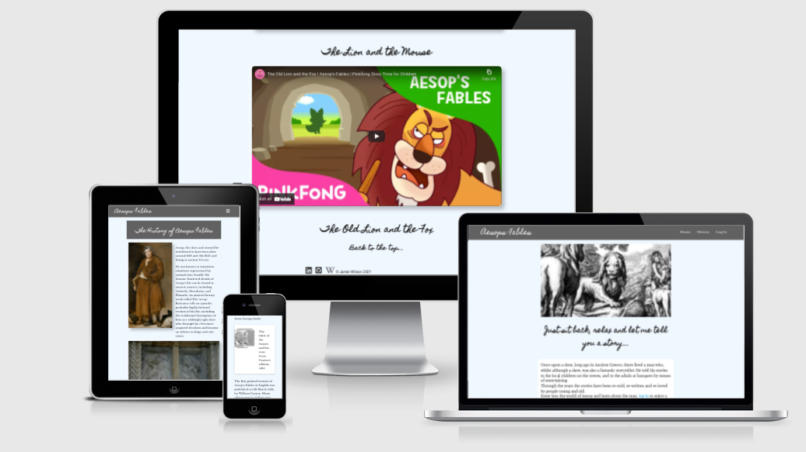
 

# Click link to visit ["Aesops Fables"](https://aesops-fables-ms3.herokuapp.com/)

# Contents

## - [Project Aims](#aim-of-the-project)
## - [User Story](#user-story)
## - [The 5 planes of UX](#the-5-planes-of-ux)
## - [Early Stages](#early-stages)
## - [The Website Features](#the-website-features)
## - [User Interaction](#user-interaction)
## - [The Coding Languages and Techniques Used](#the-coding-languages-and-techniques-used)
## - [Method of Deployment](#method-of-deployment)
## - [Methods of Testing](#methods-of-testing)
## - [Code Validations](#code-validations)
## - [Credits](#credits)

 

# Aim of the project

- The first aim of this project is to create an interesting website, reflecting on the fables written by greek storyteller Aesop. Myself, coming from a non religious background and being raised in a multi-denominational school with no religious education, the fables were a way to teach children the morals adhered to in life from a completely fictional and light-hearted perspective. For some, Aesops Fables will be completely new to them, for others it will be a chance to reflect on the stories read and taught to them throughout their childhood.

- The second aim of the project is to encourage the user to register so as to gain access to more of the sites content. Content should be varied enough to make the user feel it's  a worthwhile exercise registering.

- The third aim of the project is to encourage the creativity of the registered user visiting the site to write their own fable. In theory, each new story would be read and considered for featuring within our selection of fables. Since this is a mock-up website the purpose of this aspect is purely to demonstrate the ability to submit a story / fable and as such, obviously the tale would not be featuring in the fable selection. 

# This site should appeal to and be suited for : 

- Someone who grew up learning using Aesop Fables.
- Someone who has recently learnt and has an interest in the Fables. 
- Someone who has an interest in Greece, it's history, and is looking to expand on their knowledge of Aesop.
- Someone who has an interest in writing short stories.
- An educational body (schools, writing organisations etc) who use or have an interest in including Aesops fables into the current learning curriculum. 
 

# User Story

- As a first time visitor to the site, I would want a clean, clear user interface, instantly outlining the purpose of the site. 
- As a first time visitor I would want to be able to navigate easily to the relevant areas of the site that are of interest to me.
- As a first time visitor I would want to know the benefits of creating an account and why it is being suggested to log in.
- As a visitor to the site I would expect responsiveness across all devices so the content would look and feel the same regardless of the device used.
 

- As a returning visitor to the site I would want to log in to my account to access my personal details and any interactivity I have taken part in.
- As a returning visitor I would want to access my profile to access, edit and delete any stories I have submitted.

- User Conclusion
    - After visiting the site I would like to feel that I have enjoyed a good user experience interacting with the site.
    - I have learnt something regarding the storyteller Aesop and the fables that made him famous.
    - I have contributed to the whole experience by submitting content that could potentially be included within the site.
    - I would have gained enthusiasm and motivation to encourage educational bodies to visit the site, and encourage young learners to read the stories, and create their own.

# The 5 planes of UX

- When planning out this site I thought it important to implement the same 5 planes of UX that I had used when designing my Milestone Project 1 and 2. Doing this makes the process an easier task.

## <u>The Strategy</u>

- In planning out this website I specifically wanted to target users who fell into these brackets:
    - Those who are familiar with the fables of Aesop and wanted to revisit the stories for themselves.
    - Those who are familiar with the fables of Aesop and wanted to share them with friends, family etc.
    - Those working within an educational body wanting to share the fables as part of their curriculum.
    - Those who would use the site as an informative and interactive platform for children to learn the fables through reading the history aspects, test their knowledge, and be encouraged to become creative in writing their own tales.
    - Those who have stumbled across Aesop and want to learn more.
    - Those with an interest in Ancient Greece and wish to view relevant information.

- As a developer I would want a site that was easily maintainable and easy to update with new content as the site progressed.

    
## <u>The Scope</u>

- Based on the strategy above I began to work on the scope of the site taking into consideration the following factors:
    - The user should be able to:
        - Navigate easily around the entire site in a clear and effective manner.
        - Have the navigation areas clearly marked with full text on larger screens and the standard familiar collapsible navigational button on smaller screens.
        - Find the site attractive with text elements easy to read and images to be clear, and interesting in appearance.
        - Feel interested enough to want to register with the site to gain the extra, exclusive content.
        - Register with minimal fuss and only have to supply the absolute necessary information to create an account. 
        - Once registered, be content that the process was worthwhile and the additional content is varied and not just more text based information.
        - Find aspects of the site appealing enough that they would want to return.
        - Become interested enough that they themselves would want to return to the site to submit stories that they've written and submitted to be displayed in a future feature.
        - Introduce the site within educational departments encouraging children to interact with the site, watching stories and submitting their own.

## <u>The Structure</u>

- I planned on using set elements throughout the project so as to keep the sense of familiarity running regardless of the content on the page. Therefore I incorporated:
    - A fixed Navbar, present on all screens, displaying the relevant options to the user at their point of the journey,

    
    
---

- A floating footer bar featuring a link to the original Aesops fables page on Wikipedia and on a personal level links to my Github repositories and LinkedIn pages along with my name.

    
---

- The opening page will welcome the user to the site, explain the sites purpose and encourage the user to login to access more content. The user should notice the option to log in has been highlighted in the body of welcoming text but failing that the option to log in is also displayed within the Nav bar.

    
    

- If the user chooses not to log in then the options are limited and the user will only have access to the history page outlining certain aspects of Aesops life and stories. 
- If the user chooses to log in to the site they will be redirected to a log in page. If the user has never visited the site before then they will be required to register with the site. This is suggested at the bottom of the log in page.

    

- For the registration aspect I will have created a collection in a database within MongoDB where the information regarding the users name, email, and password will be safely stored. The password will be encrypted using the Werkzeug security password hash method.
- After registering, the user will be directed to a new screen with the new content made available to them.
    

---

- For the competition aspect I will have created a collection in a database within MongoDB where the content of the users stories will be stored. This information will include the title and the story itself. The information will be connected to the registered user.
- From here the user can access the exclusive content including a quiz and a selection of Aesop Fables cartoons. The user will also have the option to submit a story of their own to be considered in a 'future feature' on the site. 
- If the user clicks on the 'Your Stories' tab before submitting a story then they will be greeted with the information that they haven't submitted any stories at this stage and to select the competition tab to do so.
    

- If the user wishes to submit a story then after clicking on the competition tab, they will be greeted with a brief explanation of the purpose of the page, and a brief explanation of the overall 'prize' offered if the story is deemed good enough to feature in a 'future feature'.
- Below this is the input fields where the user can write or paste in the story's title and the body of the story.
    

- Once a story has been submitted the content of the 'Your Stories' page now changes to reflect the new content.
    

- As mentioned earlier, I have created a database in MongoDB for holding the necessary information required and accessed through the Aesops Fables site. The story and story title that the user composes will be kept in the collection titled competition. The username will be pre-populated with the sessions user information. 
    

- I have opted to use Materializes' collapsible element for displaying the user stories. Reason for this is that if the user chooses to submit more than story, the page will become extremely long, bulky and tedious to scroll through for the user. This way only the title will be displayed and if the user wishes to view the story then they can do so by simply expanding the title to reveal the title.

- Along with the title of the story I will have included an 'Edit' button and a 'Delete' button.
- Upon selecting the edit button the user will be redirected to an edit page wherein the user can make changes to the title and/or the story and save those changes to his/her profile 
    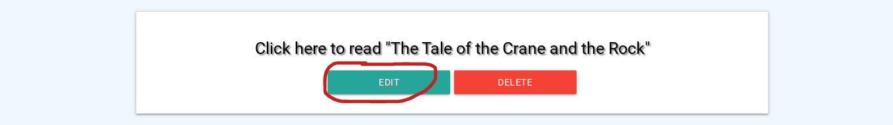
    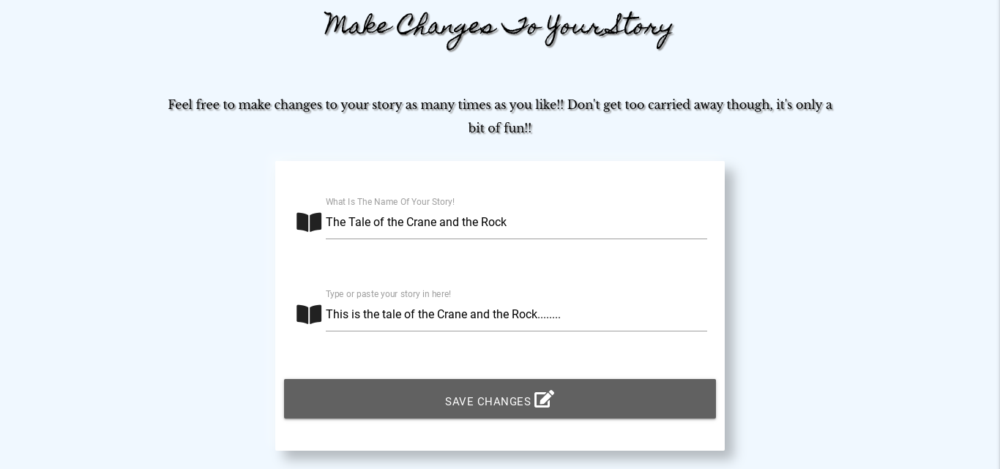

- Should the user decide that they no longer wish to keep that story then they can select the delete button.
- Once the delete button has been selected a modal will appear asking if the user is sure they wish to delete the story. Here the user will have the option to either cancel the deletion or select the delete button again removing the story from the database collection.
    
    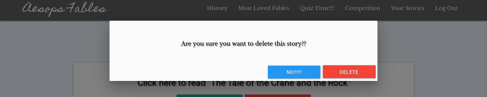
- If the user selects the 'No!!!' button then they will be redirected back to the main 'Your Stories' page.
---
- The 'Quiz Time' page will feature 5 cards, each with a question and multiple answers. 
- After thinking on the answer to the question the user will select the 'Click to reveal' portion of the card, revealing the correct answer to the question.
    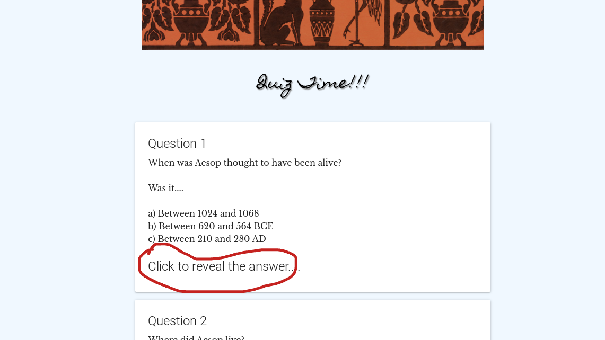

- If the user chooses to, he/she can return the card back to the question for someone else to have a guess simply by clicking on the closing X on the top right of the card.
    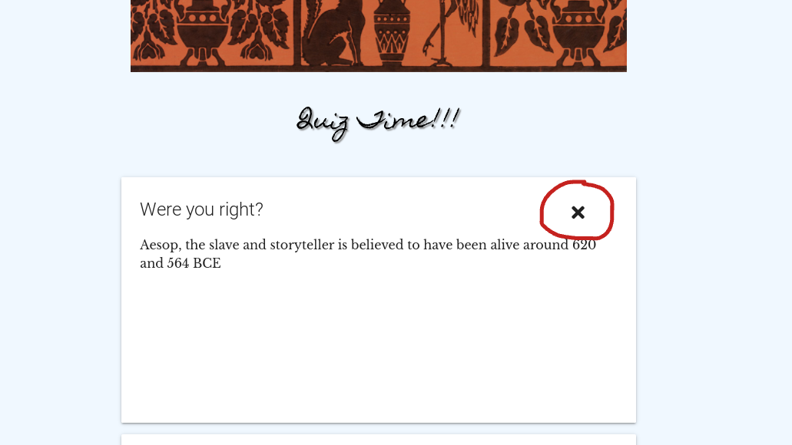

---
- The 'Most Loved Fables' page will feature 5 stories portrayed in cartoon format using embedded code from Youtube. The only interaction with these elements are to simply select to play the videos.

    

---

- The History page will not feature/require any user interaction. Textual information on the page will be subject to the size of the device the user is using to access the site.

---

- To add to the navigational aspect, I have included a 'back to the top' link on the Home, History, Most loved fables, and the Quiz time pages which is located at the bottom of each long scroll page.

      

---

- In the event that the user should encounter an error whilst navigating the site, I have created a simple 404 error page that features all the correct navigational elements of the main page along with an additional 'Home' button to ensure that the user is returned back to a functioning section of the site.

    

---

## <u>From the Skeleton to the Surface</u>

The idea of the bare bones of the project were sketched out in wireframes using Balsamiq. Laid out below is the realization of each main structure into its actual state.

- The Home Page I wanted a simple interface, a Navigation bar featuring the title of the site, and options available to the visitor at this point. On smaller screens a side navigational bar will hold the options. A main image depicting one of Aesops tales, and a brief introduction and explanation into what the visitor can expect from the site.  
*# Actual screen grab does not indicate full content of screen*  

&nbsp;

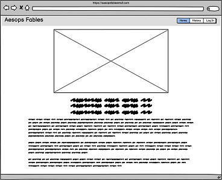

&nbsp;

- The History Page is the only content available to the visitor to the site at this stage without registering / logging in. I wanted to keep the information to short bursts outlining key points with images rather than masses of text to read through.  
*# Actual screen grab does not indicate full content of screen*  

&nbsp;

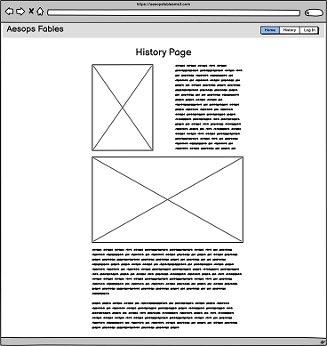
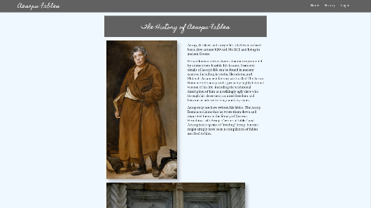

&nbsp;

- The Log In Page is where the visitor has the option to log in or register to access more content within the site. There is a link at the bottom of the page alerting the visitor that if not currently registered then the link will take them to the necessary registration page.  

&nbsp;

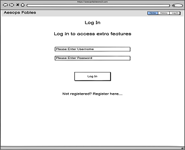

&nbsp;

- The Registration Page is where the visitor to the site can give minimal details to become a user of the site and have access to extra content within the site. 

&nbsp;
 

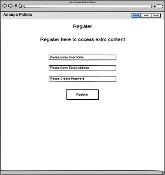

&nbsp;

- Once registered / logged in the user will be greeted by a revision of the home page but this time there will be more information regarding the new content available to them. 

&nbsp;
 

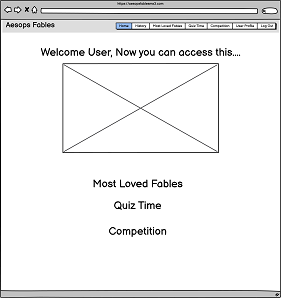
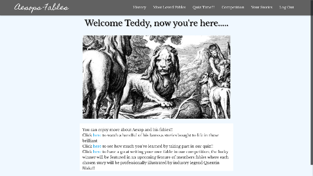

&nbsp;

- The Most Loved Fables page is where the user can watch a selection of cartoons depicting some of the most popular of Aesops fables. This can either be done within the site or by selecting the "Watch on Youtube" option which will take the user to the Youtube website.  
*# Actual screen grab does not indicate full content of screen*  

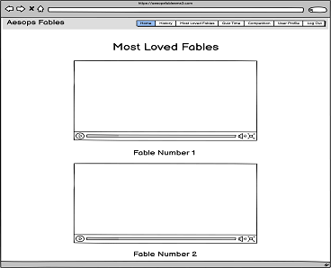

&nbsp;

- The Quiz Time page is where the user can test his/her knowledge of Aesop based on the information scattered throughout the site. This is only a fun aspect so there is no score kept. The premise is that the questions are featured on cards that reveal the answer when clicked on.  
*# Actual screen grab does not indicate full content of screen* 

&nbsp;
 

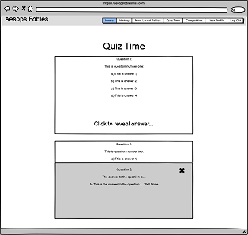

&nbsp;

- The Competition page is where the user will have the opportunity to submit a story of their own to be considered in a fictional upcoming feature that would in theory showcase the best stories written by the visitors to the site.

&nbsp;

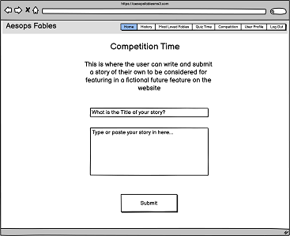

&nbsp;

- The User Profile (Your Stories) page is where users can go back to read their own stories. If they so wish, the option to edit them or delete them is also presented to them as well. The Story element is contained within a collapsible element so as to keep the page looking tidy and economical.  
As mentioned and outlined previously, should the user wish to delete their story / stories then a modal will appear checking if the user really wants to delete the story.

&nbsp;

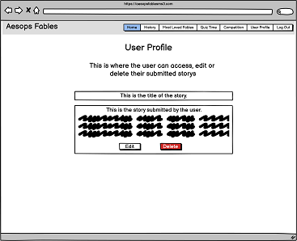
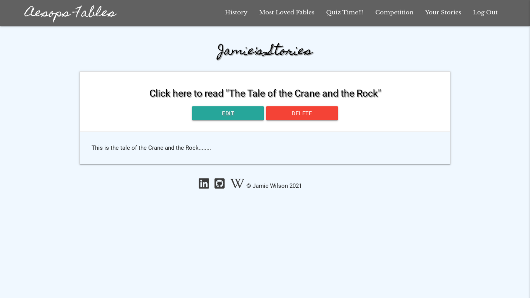

&nbsp;

- The final option available to the user is to log out of the site. Upon doing so the user will be returned back to the generic home page with a flash message that they have been logged out and to come back soon.  
*# Actual screen grab does not indicate full content of screen* 

&nbsp;

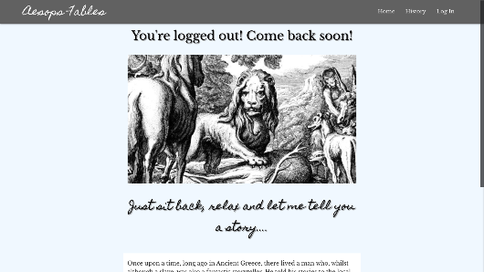

---

## MongoDB

- As mentioned above, there are 2 instances within the site where the user is prompted to log personal information. To hold this information I used MongoDB. MongoDB is a free to use, non-relational database that stores data in flexible, JSON-like documents, meaning fields can vary from document to document and data structure can be changed over time. This proves to be a better option for storing data rather than the regimented relational databases such as SQL.
- The first set of information requested is when registering with the site, here the visitor will be asked to create a username, give their e-mail address, and finally create a password. These credentials will be necessary in future visits to the site to be able to log in and access their participation in events featured on the site.  
- To protect the users security when offering a password I imported the Werkzeug.security method that comes installed when installing Flask. This offers the opportunity to be able to store the required field as an irreversible hashed password. This is generated with a specific command within the app.py file.
-  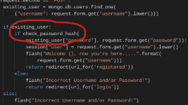  
- From this point on, when the visitor creates a password the characters entered will be made unrecognisable within the database making it impossible to read if the database should become compromised.
-    
- The second batch of information is when the user decides to write and submit a story for consideration in the competition section of the site.  
- I decided to break these two sets of data into two collections within MongoDB. One collection to hold the users log in details and the second purely to house the story elements submitted by the user.

- 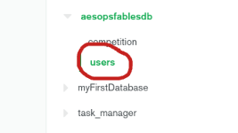 

---

# Early Stages

## Wireframes

- A wireframe summary of the home page on desktop, tablet, and mobile view.

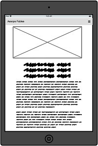

- A wireframe summary of the history page on desktop, tablet, and mobile view.

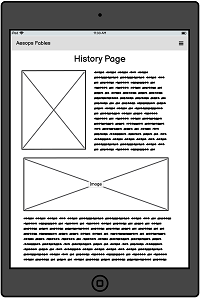
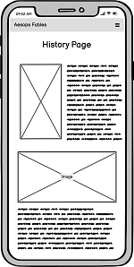

- A wireframe summary of the Log In page on desktop, tablet, and mobile view.

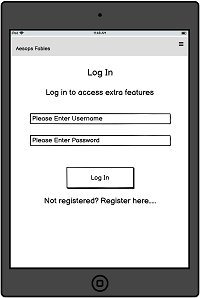
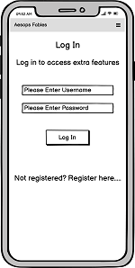

- A wireframe summary of the Registration page on desktop, tablet, and mobile view.

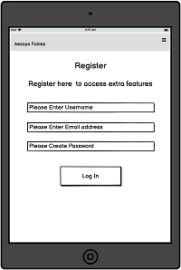
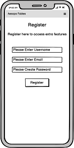

- A wireframe summary of the Logged In / Registered page on desktop, tablet, and mobile view.

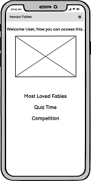

- A wireframe summary of the User Profile page on desktop, tablet, and mobile view.

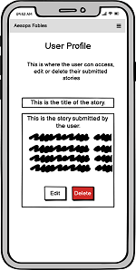

- A wireframe summary of the Most Loved Fables page on desktop, tablet, and mobile view.

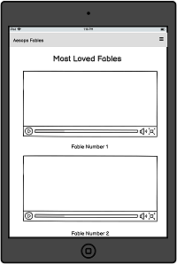

- A wireframe summary of the Quiz Time page on desktop, tablet, and mobile view.

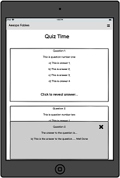

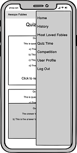

- A wireframe summary of the Competition page on desktop, tablet, and mobile view.

- A wireframe summary of the User Profile Story Edit page on desktop, tablet, and mobile view.

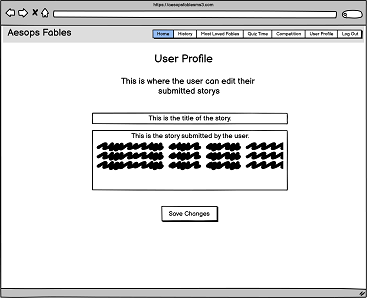

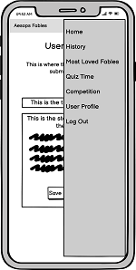

- A wireframe summary of the User Profile Story Delete page on desktop, tablet, and mobile view.

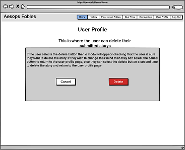

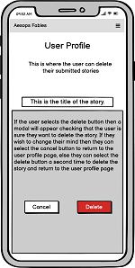
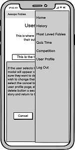

- Various Flash Messages Featured Throughout Site

---

# Colour Schemes

For the colour scheme I decided to keep things as simple as possible so as not to distract from the content.  

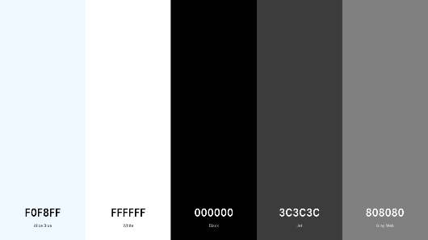  

## Breakdown Of Use Of Colours

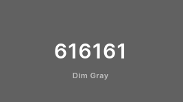  
Along with the main colors I created for use throughout the website I opted to use the pre-defined color (#616161, "grey") built into the NavBar element I imported in from Materalize.  

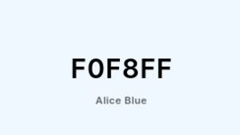  
I used this colour for the background throughout the entire site. I wanted a very clean background but with enough of a tint to offset the white that would also be used throughout the site.

  
I used this color for the text when placed on a dark grey background. I found the contrast made the text very easy to read.

  
I used this color for the text when placed on the lighter backgrounds. I found the contrast made the text very easy to read. I also opted in places to accentuated the text with a text-shadow using a dark grey shadow (#808080).

  
I used this color to accentuate text in certain places throughout the site. Mainly on page subtitles and returning links. 

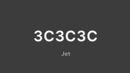  
I used this color on the icons that run along the bottom of the sites content.  
  
To ensure good, consistant readability throughout the site I ran a contrast check on my text to background color ratio and was pleased with the results.

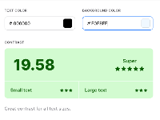
 
  
---

## Fonts

For the textual elements I imported in two font family variants from Google Fonts.

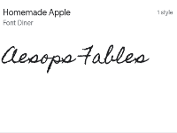 

- I used "Homemade Apple" as the main 'branding' aspect of the site due to it's handwriting look and feel. 
- I used "Libre Baskerville" in it's regular 400 font for the main body of text throughout the site. I felt that the text was clear to read whilst having a slight cursive feel to the text.
- I have highlighted the use below with the main title displayed using 'Homemade Apple' and the navigational buttons on the left using 'Libre Baskerville'.  

  

&nbsp;
  

---

# The Website Features

- ## <u>As Submitted</u>

    - A landing page welcoming the visitor .
    - A history page providing information on the subject matter.
    - A log in page wherein the visitor can log in to access extra content.
    - A registration page wherein the visitor (thereafter referred to as the user) can register with the site to access more content. Information stored in a collection within MongoDB
    - A fables page where the user can watch a handful of fables presented in cartoon format.
    - A quiz page where the user can test his/her knowledge on Aesop from what they've learnt viewing the site.
    - A competition page where the user can submit their own story to be included in a future feature. Information stored in a collection within MongoDB
    - A profile page where the user can view submitted stories and be presented with the option to edit or delete them. Information retrieved from the relevant collection in MongoDB
    - After the user has finished viewing the content there is a log out button provided in the nav elements so allowing another user to log in.
       
- ## <u>Features I would include in the future</u>

    - A history page broken down into tabbed sections with each section featuring a more in depth insight into Aesop and his fables. Tabs could feature things like, history, fables, literature, educational aspects etc.
    - The fables page would hold a mixture of film and reading matter for the user to view at their leisure.
    - The quiz page to feature more in depth questions and some visual questions.
    - A major feature would be a section displaying 2-3 users stories for others to enjoy. These would be selected by the admin and would feature bespoke drawings depicting the content of the story. These stories would change on a monthly basis and be credited to the user responsible for writing them.
    - Along with the user stories section, the option would also be available for other users of the site to be able to vote for their favourite during their visit and be able to leave comments readable for the owner of the tale.  

---

# User Interaction

- The following aspects can be interacted with:

    - On desktop, the main navigational tags depending on what stage the visitor is at within the site featuring on the main Navbar.
    - On mobile devices the sidebar menu 'burger' will display the same options depending on what stage the visitor is at within the site. 
    - Each navigational tag will direct the user to the relevant page.
    - Where necessary, each relevant page will feature a 'Back to top' element returning the user to the top of the page.
    - In the log in page the field for entering in a username.
    - In the log in page the field for entering in a password.
    - In the log in page there will be a submit button
    - In the registration page the field for creating a username.
    - In the registration page the field for entering the email address.
    - In the registration page the field for creating a password.
    - In the registration page there will be a submit button. 
    - On the registered page each element informing the user of extra content will feature a link to redirect the user direct to that specific page.
    - On the fables page each video will be playable either within the site or by selecting to watch the video within Youtube.
    - In the quiz page, the user will be able to 'Click to reveal the answer' for each question.
    - In the quiz page, when the user has revealed the answer there is a X displayed prompting the user to close the answer card if they so wish.
    - In the competition page, there will be a field for entering their story title.
    - In the competition page, there will be a field for entering the body of their story.
    - In the competition page, there will be a submit button.
    - In the Your Stories page, there will be a collapsible element that will reveal the body of the users story once selected.
    - In the Your Stories page, there will be an Edit button and a Delete button.
    - In the Your Stories page, if the delete button is selected then a modal will appear with 2 more additional elements to interact with. One being a cancel deletion button and the other being a delete button.
    - In the footer of the page there is a linkedIn icon that will redirect the visitor to my own linkedIn page.
    - In the footer of the page there is a Github icon that will redirect the visitor to my own Github repositories page.
    - In the footer of the page there is a Wikipedia icon that will redirect the visitor to the Wikipedia page where the historical text and imagery was sourced from.

# The Coding Languages and Techniques Used

- This site was constructed using:
    - HTML5
    - CSS3
    - Javascript
    - jQuery
    - Materialize
    - Jinja
    - MongoDB
    - Heroku
    - Fontawesome
    - Balsmiq was used for creating the wireframes for this project.

## Using MongoDB in the site.

- Listed below is the method for initiating and using MongoDB to store site data in a collection within MongoDB.
    - Firstly, navigate to www.MongoDB.com.
    - Click on either 'Try Free' or 'Start Free'  

    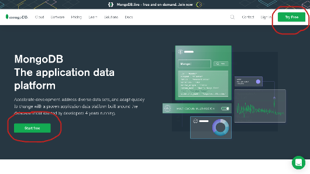

    - Once selected you will need to fill out your personal details.

    

    - Once filled out you will be prompted to verify your email address.

    - Then select 'Build a Database'

     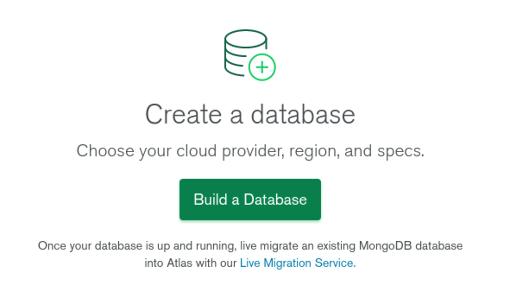

    - Next you need to choose which option is best suited for your purposes to deploy your cloud database. For the purposes of this site I chose the shared option which is free.

    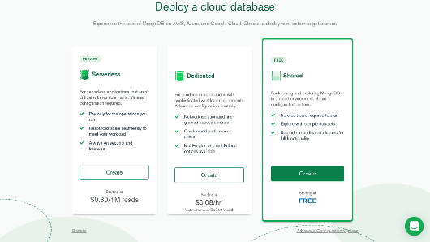

    - Next you want to select your cloud provider and the region applicable to you. In this case I selected AWS and because I live in Ireland, I'd select Ireland.

    

    - Next, select a cluster tier. This is similar to buying cloud storage. Price depends on the size of the storage needed. In this instance select M0 which is 'Free Forever'.

    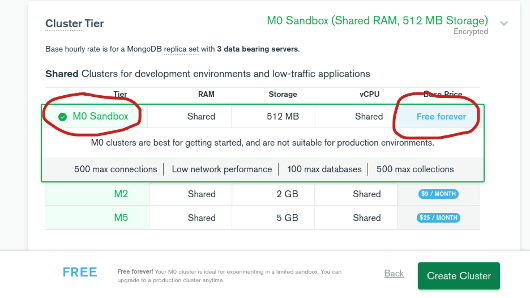

    - Lastly in this section, give the cluster a name, (this can only be done once), and select 'Create Cluster'. This may take 1-3 minutes to complete.

    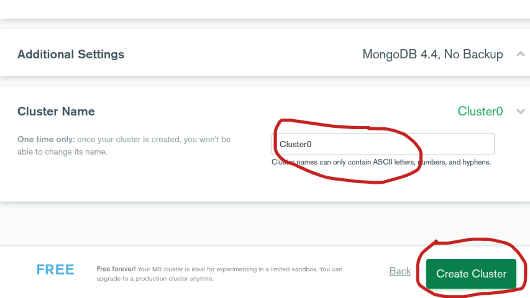

    - Inside of the main cluster workspace, under Security select 'Database Access'. This will bring you to the next step of adding a database user. Select 'Add New Database User'.

    

    - Within the new database user form make sure that the Authentication Method is set to Password, create a username and password. Under the 'Database User Privileges' make sure that 'Read and write to any database' is selected and finally select 'Add User'. Remember to never share or include your username and /or password in any capacity. Doing so will give someone full access and potentially jeopardize the database. 

    

    - With the new user added, select 'Network Access' from the menu on the left titled 'Security' and then select 'Add IP Address'.

    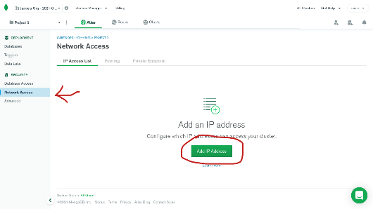

    - It's here that we can 'whitelist' our IP address, basically letting MongoDB know that our IP address is safe to access the database. Ideally, for extra security the user should select 'Add Current IP Address' and specify certain IP addresses. For the purpose of this demonstration I have selected 'Allow Access From Anywhere'

    

    - With that done, head back to Databases under the 'Deployment' heading and select 'Browse Collections'. In the following screen, select 'Add My Own Data'.

    

    - Here now, you can name your own database using no spaces and incorporating camelcase for more than one word in the title, and within that, name your first collection.

    

    - As you can see here, once the database and collection has been named, you return back to the main screen and you can see the new database and collection ready to use.

    

    - From this point on you can insert documents into the collection via the 'Insert Document' within the cluster page or generate documents programmatically. You will notice also that each document comes with a unique ID code which contains a timestamp of when the document was created.

    

# Method of Deployment

- My two previous Milestone projects were deployed on GitHub pages due them being more frontend, static sites. This current project is a data-centric, back-end project and therefore I had to use a host that is suited to my needs, ie: Heroku, Elastic Beanstalk, Firebase.

- To fully test the site on multiple 'real-world' devices I wanted to create a live link to the site relatively early on that could be accessed universally. To do this, I opted to deploy the site using Heroku. To do similar the user should: 

    - Firstly, make sure that a requirements.txt file has been created and that it contains the details of the necessary packages/modules used within the program code. If extra packages/modules are introduced throughout the development of the site then it is important to update their existence within the requirements.txt file so that they are utilised by Heroku.
    
    - Secondly a Procfile must be created with the name of the application file (app.py) so Heroku knows which file to access first. This is only a short one line file but ultimately very important!!  
    
    - Lastly these files must be pushed to GitHub in preparation for deploying the site through Heroku.  

&nbsp;
 

- Once the above steps have been followed the user should follow the next steps:

    - Step 1: Open Heroku.com and sign in.
    - Step 2: Once signed in the user should see a list of apps previously created (if any) in chronological order. In the top right corner click on new and select 'Create new app'.
    
      

    - Here the user will now name the app you wish to create. This must be written in lowercase and replace any spaces with the minus/dash character. As the user writes the name of the app, a guidance note will appear displaying if the name is available or not. Following this the user must select a region between United States and Europe.  

      

    - The next step brings the user the options for how to deploy their app, basically how to access the code written. For this example we will presume the user has the code in GitHub so select 'Connect to Github' and type the name of the repository you wish to have deployed.

      

    - Once Heroku has found the repository it will be displayed below and the user simply has to click select.
    - If the user has stored the environment variables within a hidden env.py file (which is common,  safe practise), Heroku won't be able to read those variables. To make the variables accessible to Heroku, click on the 'Settings' tab for your app, and then click on 'Reveal Config Vars', where the user can securely tell Heroku which variables are required and their subsequent values.  

      

    - Presuming that the user has the Procfile and all other relevant files added and pushed through to GitHub then the user should then select 'Enable Automatic Deployment'. If the user has the main branch for deploying then select 'Deploy Branch'.
    - Once these options have been selected, Heroku will have gained access to the site and start building the app based on the required files. Once completed, Heroku will display the message 'Your app was successfully deployed'. Click 'View' to launch the app.
    - In the settings page, the user can find the url for accessing the site on all devices and browsers.  

    

    - From this point on, all new code pushed to GitHub will be read and displayed through the app. It is important to deploy early in the apps development so as to making the testing stages a longer, more thorough investigation into the overall working of the code.

- From this point on you can type in and access your site on any device with an internet browser which is ideal for testing purposes.

## For those wishing to develop the site further using a repository clone:
- You must first ensure that you have a current Github account.
- Be running the most up to date version of Google Chrome with the Gitpod browser extension installed.
- Login to Github with your own github account.
- Navigate to the Project Github Repository page.
- Click the New button, this will trigger a new workspace.
- Under Create a new Repository select Import a Repository
- Now, in the Your Old Repository Clone URL field, type in "https://github.com/JamieWilson2000/aesopsfablesms3.git"
- Enter in a new relevant repository name and click Begin Import.
- After a short while you'll recieve a message saying that the new repository is ready with a link to take you to it.
- Open gitpod.
- To ensure that all packages/modules are in place type 'pip install -r requirements.txt' in the terminal. As long as the requirements file is up to date, this will install all elements for running the site.  

# Methods of Testing

- Throughout the development stage I used a handful of methods to ensure the site looked and acted appropriately.  These included:

    - Chrome Dev Tools - for testing stylings, sizing, and responsiveness

    - Mozilla Dev Tools - for testing stylings, sizing, and responsiveness

    - http://ami.responsivedesign.is/ - for general look and feel of the site.

    - https://coolors.co/ - for picking color schemes and testing contrast colors

    - Heroku.com - to access the live site across different devices

    - Google Lighthouse - to test perfomance 

---  
# Summary of User Testing

# User Story Recap

- As a first time visitor to the site, I would want a clean, clear user interface, instantly outlining the purpose of the site. -- **<strong>[See Test 1](#test-1)</strong>**
- As a first time visitor I would want to be able to navigate easily to the relevant areas of the site that are of interest to me. -- **<strong>[See Test 2](#test-2)</strong>**
- As a first time visitor I would want to know the benefits of creating an account and why it is being suggested to log in. -- **<strong>[See Test 1](#test-1)</strong>**
- As a visitor to the site I would expect responsiveness across all devices so the content would look and feel the same regardless of the device used. -- **<strong>Checked across all tests</strong>**
 

- As a returning visitor to the site I would want to log in to my account to access my personal details and any interactivity I have taken part in. -- **<strong>[See Test 4](#test-4)</strong>**
- As a returning visitor I would want to access my profile to access, edit and delete any stories I have submitted. -- **<strong>[See Test 8](#test-8)</strong>**

## Test 1  
### <u>Accessing the site.</u>

As a first time visitor to the site, I would want a clean, clear user interface, instantly outlining the purpose of the site.  

<strong>Test Description:</strong> This is to test that the visitor will be greeted with the above.

<strong>Steps Taken</strong>  

- Navigate to http://aesops-fables-ms3.herokuapp.com/  

<strong>Image of Test Result</strong>  
  

- The text should reflect the purpose of the site and the benefit to the visitor of registering / logging in.  

<strong>Considered Pass/Fail:</strong> Pass  

## Test 2  
### <u>Identifying the Navigational elements.</u>

As a first time visitor to the site, I want a clean clear navigational system in place.

<strong>Test Description:</strong> This is to test that the visitor will know how to navigate around the site.

<strong>Steps Taken</strong>

- On desktop, the user should notice the options available placed clearly in the top right hand corner.  
- On mobile devices, the user should notice a collapsible menu button, familiar in todays web applications and be able to access the options available.  
<strong>Image of Test Result</strong>  
  
    
<strong>Considered Pass/Fail:</strong> Pass  

## Test 3
### <u>Accessing the 'History' page.</u>

As a first time visitor to the site, I want to access content available to me at this point.

<strong>Test Description:</strong> This is to test that the visitor can access the content available to them at this stage..

<strong>Steps Taken</strong>  
    
- On desktop, the user should select the history option available placed clearly in the top right hand corner.  
- On mobile devices, the user should notice a collapsible menu button, familiar in todays web applications and be able to access the history option available.  
<strong>Image of Test Result</strong>  
  

- When reaching the bottom of the page there is a 'Back to top' link that should return the user to the top of the page.
    

<strong>Considered Pass/Fail:</strong> Pass  

## Test 4
### <u>Accessing the 'Log In' page.</u>

<strong>Test Description:</strong> This is to test that after viewing the opening content, the visitor can access the extra content available via registering / logging in.

<strong>Steps Taken</strong>  
    
- On desktop, the user should select the 'Log In' option available placed clearly in the top right hand corner.  
- On mobile devices, the user should notice a collapsible menu button, familiar in todays web applications and be able to access the 'Log In' option available.  
<strong>Images of Test Results</strong>  

  

- The user should be presented with the log in form. 
- The user should note that if not previously registered on the site then a navigational link is available to them underneath the log in form.

   

- Upon clicking the 'Register Here' link, the user should be taken to the registration page.  

    

- Upon filling out the requested form, the user should be presented with the extra content as promised in the opening page.  

   

<strong>Considered Pass/Fail:</strong> Pass  

## Test 5  
### <u>Accessing the 'Most Loved Fables' page.</u>

As a first time visitor to the site, I want to access the extra content available to me.

<strong>Test Description:</strong> This is to test that the visitor can access the content and that the videos all play.

<strong>Steps Taken</strong>  
    
- On desktop, the user could select the 'Most Loved Fables' option available placed clearly in the top right hand corner.  
- On mobile devices, the user should notice a collapsible menu button, familiar in todays web applications and be able to access the 'Most Loved Fables' option available.  
<strong>Image of Test Result</strong>  
    

- To watch each video, the user has to either click the main play button or choose to 'Watch on Youtube'

- When reaching the bottom of the page there is a 'Back to top' link that should return the user to the top of the page.
    

<strong>Considered Pass/Fail:</strong> Pass 

## Test 6
### <u>Accessing the 'Quiz Time' page.</u>

As a first time visitor to the site, I want to access the extra content available to me.

<strong>Test Description:</strong> This is to test that the visitor can access the 'Quiz Time' page and participate in the quiz understanding how the game works.

<strong>Steps Taken</strong>  
    
- On desktop, the user could select the 'Quiz Time' option available placed clearly in the top right hand corner.  
- On mobile devices, the user should notice a collapsible menu button, familiar in todays web applications and be able to access the 'Quiz Time' option available.  
<strong>Images of Test Results</strong>  
  

- Questions are placed on cards with the user prompted to 'Click to reveal the answer' wherein once selected the answer will become visible. To close the card again, users will notice a close symbol on the right of the card. 

  

- When reaching the bottom of the page there is a 'Back to top' link that should return the user to the top of the page.  

    

<strong>Considered Pass/Fail:</strong> Pass 

## Test 7
### <u>Accessing the 'Competition' page for submitting a story.</u>

As a first time visitor to the site, I want to access the extra content available to me.

<strong>Test Description:</strong> This is to test that the visitor can access the 'Competiton' page

<strong>Steps Taken</strong>  
    
- On desktop, the user could select the 'Competition' option available placed clearly in the top right hand corner.  
- On mobile devices, the user should notice a collapsible menu button, familiar in todays web applications and be able to access the 'Competition' option available.  
<strong>Images of Test Results</strong>  
  

- After completing the required fields, the user should be redirected to their 'Your Stories' page. Here they will be presented with a collapsible element displaying their submitted story.  

<strong>Considered Pass/Fail:</strong> Pass 

## Test 8
### <u>Accessing the users 'Your Stories' page.</u>

As a first time visitor to the site, I want to access the extra content available to me.

<strong>Test Description:</strong> This is to test that the visitor can access the exclusive content available to them at this stage..

<strong>Steps Taken</strong>  
    
- On desktop, the user could select the 'Your Stories' option available placed clearly in the top right hand corner.  
- On mobile devices, the user should notice a collapsible menu button familiar in todays web applications and be able to access the 'Your Stories' option available.  
<strong>Images of Test Results</strong>  
  

- The user should notice that here, the option to click to read their submitted story. When clicked on should reveal the story in it's entirity.  

Before:  

After:  

- In the event that the user hasn't submitted a story before accessing this page then he/she should be greeted with the flash message informing them of this and a prompt on where to go to do so.

<strong>Considered Pass/Fail:</strong> Pass  

## Test 9
### <u>Editing the Users Stories.</u>

<strong>Test Description:</strong> This is to test that the visitor can access and edit their submitted story.

<strong>Steps Taken</strong>  
    
- Within the 'Your Stories' page, the option to edit and delete the stories are available to the user.
- Upon selecting the 'Edit' button, the user is taken to the page for editing their story.  
- The story title field should be pre-populated with the users story title and the story field should be pre-populated with the users story.  
<strong>Images of Test Results</strong>  
  

- Here the user can make changes to both the title of the story and the main body of the story if he/she so wishes to. Once satisfied with the changes made the user should select the 'Save Changes' button to submit the changes to the database and therefore to the users 'Your Stories' page.  
  
- And once 'Save Changes' has been selected the user should see that the changes have been saved. 

<strong>Considered Pass/Fail:</strong> Pass  

## Test 10
### <u>Deleting the Users Story.</u>

<strong>Test Description:</strong> This is to test that the visitor can access and delete their story if they so wish.

<strong>Steps Taken</strong>  
    
- Within the 'Your Stories' page, the option to edit and delete the stories are available to the user.
- Upon selecting the 'Delete' button, the user is presented with a second option. Here the user is given the option to change their mind and keep the story or continue with their choice to delete the story.   
 
<strong>Images of Test Results</strong>  
 

- Once selected this modal appears: 

  
- If 'No!!!' is selected then the user will be redirected back to the stories page but if the 'Delete' button is selected again then the user is presented with this flash message.    

<strong>Considered Pass/Fail:</strong> Pass 

## Test 11  
### <u>Logging Out.</u>

<strong>Test Description:</strong> This is to test that the visitor can log out of the site.

<strong>Steps Taken</strong>  
    
- The user should note that after finishing his/her time on the site then in the top right hand corner the option is there to log out.
- Upon selecting the 'Log Out' option the user should be greeted with the home page again and a flash message informing the user that he/she has been logged out.
- Further confirmation that the user has been logged out should be the navigational items in the Nav bar and the mobile side Nav bar returning back to the limited content again.
 
<strong>Images of Test Results</strong>  
    

<strong>Considered Pass/Fail:</strong> Pass 

## Test 12
### <u>Accessing Social Icons.</u>

<strong>Test Description:</strong> This is to test that the social icons redirect the user to the relevant site, opening in a new tab.

<strong>Steps Taken</strong>  
    
- Should the user wish to explore one of the social icon options then by clicking on one should redirect them to the relevant page in a new tab.  

<strong>Images of Test Results</strong>  

- Firstly to test the LinkedIn social icon:

   
 
<strong>Considered Pass/Fail:</strong> Pass 

- Next to test the GitHub social icon:

   
 
<strong>Considered Pass/Fail:</strong> Pass

- Lastly to test the Wikipedia social icon:

   
 
<strong>Considered Pass/Fail:</strong> Pass

- CONCLUSIONS
    - After extensive testing across various devices, I was satisfied with the overall look and feel of the site. 
    - I am satisfied that each of the users needs have been addressed.
    - I am satisfied with the content and the presentation of the content.

## Problems and bugs experienced along the way

- Problem: Image not displaying on homepage
- Fix: I created the images folder inside of the assets folder which wasn't being recognised in the url_for string so I tried creating the folder and contents inside the static folder and that solved the problem.
- Problem: iframe element spilling out of grid container.
- Fix: To fix this I researched and referenced the website "https://tylerduprey-52451.medium.com/a-perfect-video-container-with-css-37fd454c5eb5 on how to create the perfect video container. Following on from that I then styled the element to suit.
- Problem: When creating the Your Stories page all records from the collection are being displayed rather than just the signed in user.
- Fix:  Fixed session variables on logging into profile.
- Problem: Could not display other values to the Your Stories page using Jinja.
- Fix: Discovered that previously I had made an amendment to the username field direct in MongoDB so the field that the code was looking for no longer existed. After rolling back to the original entry the values display to the page.
- Problem: Could not display flash message on Your Stories page informing user that they had not submitted a story yet.
- Fix: Discovered that I wasn't checking if the collection existed in the correct method so adopted the count() method to determine if the corresponding collection existed, if it did exist then go ahead and display the story, if it doesn't then display the flash message with the relevant message. 
- Problem: Discovered that when deleting a story from the Your Stories page, the wrong story is being deleted.
- Fix: I realized that I hadn't targeted any related values to the modal button so to fix this I added a jinja reference to the selected _id within the modal buttons data target and the modals id field.

# Code Validations

## HTML Validator

- I ran each html file through the W3 Html Validator and have displayed the results below. Due to each file not containing 100% HTML, issues did arise but I was confident that any issues weren't faults within my HTML code.  
- **Errors highlighted in yellow.**

- This is the validation for the 404.html file.

## CSS Validator

I ran my CSS file through the W3C CSS Validator and was pleased with the results.  
Results shown below:  

## Javascript Validator

I ran my limited script file through the JSHint Validator and came back with one undefined variable.  
Results shown below:  

## Lighthouse Testing

I ran the site through Google Lighthouse to check general performance and accessibilities and was reasonably content with the results on both desktop and mobile.  
Results shown below:  

# Credits

- For information on Aesop and his fables: https://en.wikipedia.org/wiki/Aesop%27s_Fables

- To contain the video element: https://tylerduprey-52451.medium.com/a-perfect-video-container-with-css-37fd454c5eb5

- Image used on quiz page collected from: https://kidsreadnow.org/lessons-from-reading-fables/

- For help fixing a problem regarding the iframe elements I referenced: "https://tylerduprey-52451.medium.com/a-perfect-video-container-with-css-37fd454c5eb5  

- For creation of color scheme I used: https://coolors.co
- To run a contrast check on my text elements I used the facility in https://coolers.co

## Throughout the creation of this project I have referred to the following for assistance and guidance:

- https://codeinstitute.net/

# Acknowledgement

# - [Back to top](#contents)

