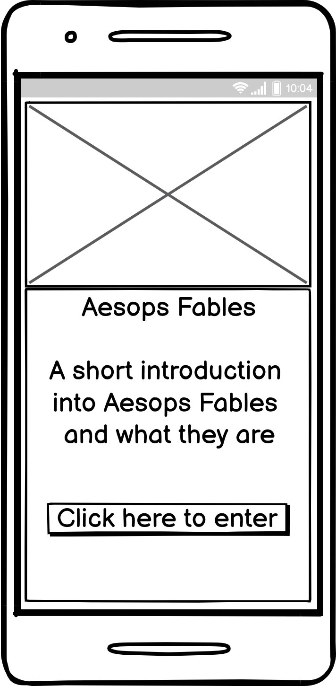
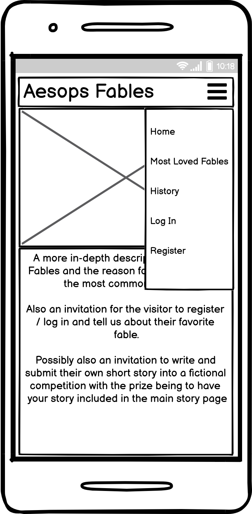
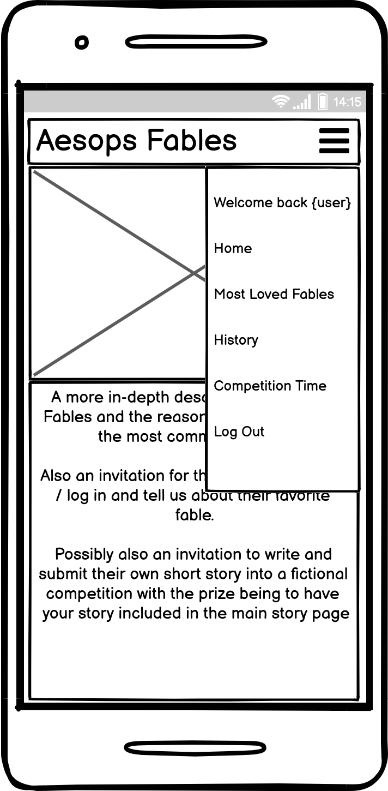
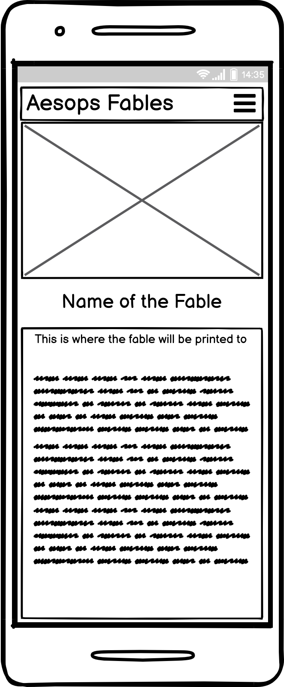
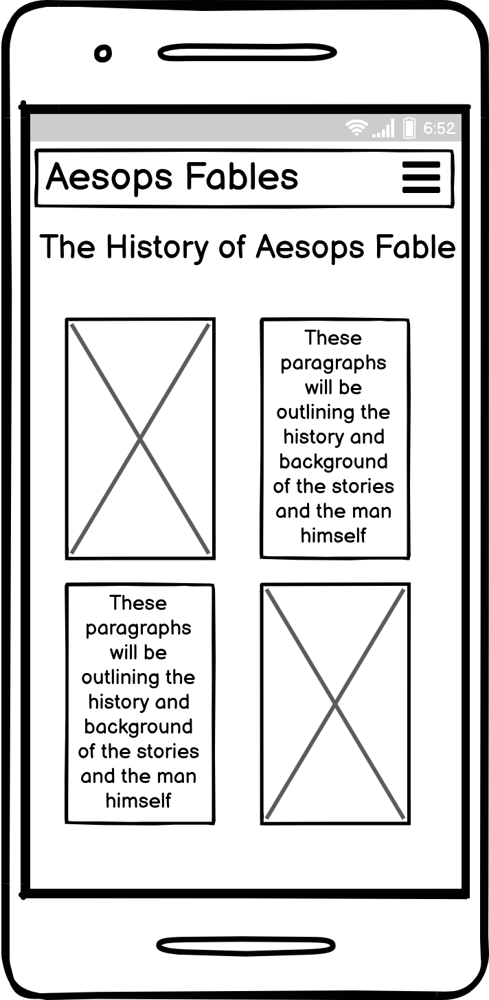
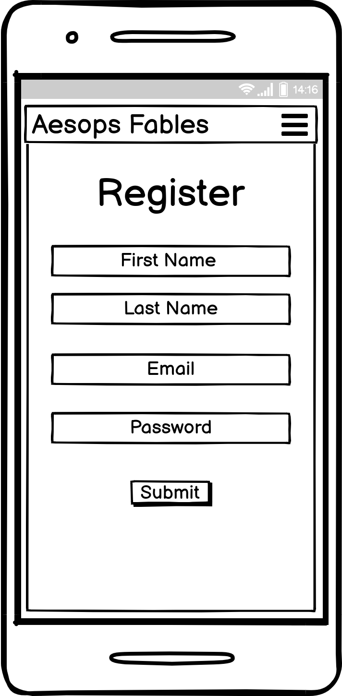

# <u>Milestone Project 3: Aesops Fables</u>

 

# [Link to visit ""]()

# Contents

## - [Project Aims](#aim-of-the-project)
## - [User Story](#user-story)
## - [The 5 planes of UX](#the-5-planes-of-ux)
## - [Early Stages](#early-stages)
## - [The Website Features](#the-website-features)
## - [User Interaction](#user-interaction)
## - [The Coding Languages and Techniques Used](#the-coding-languages-and-techniques-used)
## - [Method of Deployment](#method-of-deployment)
## - [Methods of Testing](#methods-of-testing)
## - [Code Validations](#code-validations)
## - [Credits](#credits)

 

# Aim of the project

- The first aim of this project is to create an interesting website, reflecting on the fables written by greek storyteller Aesop. Myself, coming from a non religious background and being raised in a multi-denominational school with no religious education, the fables were a way to teach children the morals adhered to in life from a completely fictional and light-hearted perspective. For some, Aesops Fables will be completely new to them, for others it will be a chance to reflect on the stories read and taught to them throughout their childhood.

- The second aim of the project is to encourage the creativity of the user visiting the site to write their own fable. Each new story would be read and considered for featuring within our selection of fables. Since this is a mock-up website the purpose of this aspect is purely to demonstrate the ability to submit a story / fable and as such, obviously the tale would not be featuring in the fable selection. 

# This site should appeal to and be suited for : 

- Someone who grew up learning using Aesop Fables.
- Someone who has recently learnt and has an interest in the Fables. 
- Someone who has an interest in Greece, it's history, and is looking to expand on their knowledge of Aesop.
- An educational body (schools, writing organisations etc) who use or have an interest in including Aesops fables into the current learning curriculum. 
 

# User Story

- As a first time visitor to the site, I would want a clean, clear user interface, instantly outlining the purpose of the site. 
- As a first time visitor I would want to be able to navigate easily to the relevant areas of the site that are of interest to me.
- As a first time visitor I would want to know the benefits of creating an account and why it is being suggested to log in.
- As a visitor to the site I would expect responsiveness across all devices so the content would look and feel the same regardless of the device used.
 

- As a returning visitor to the site I would want to log in to my account to access my personal details and any interactivity I have taken part in.
- As a returning visitor I would want to access my profile to check results of competitions entered.
- As a returning visitor I would want to be able to contact the administrators of the site to ask questions, suggest new ideas, complain regarding content, etc.

- User Conclusion
    - After visiting the site I would like to feel that I have enjoyed a good user experience interacting with the site.
    - I have learnt something regarding the storyteller Aesop and the fables that made him famous.
    - I have contributed to the whole experience by submitting content that could potentially be included within the site.
    - I would have gained enthusiasm and motivation to encourage educational bodies to visit the site, and encourage young learners to read the stories, and create their own.

# The 5 planes of UX

- When planning out this site I thought it important to implement the same 5 planes of UX that I had used when designing my Milestone Project 1 and 2. Doing this makes the process an easier task.

- ## <u>The strategy</u>
    
- ## <u>The Scope</u>
    
- ## <u>The Structure</u>
    
- ## <u>The Skeleton</u>
    
- ## <u>The Surface</u>
    
   
    ---
# Early Stages

## Wireframes

- Above is a summary of the wireframes for this site in it's mobile version.

- EXPAND ON ABOVE WIREFRAMES

- EXPAND ON ABOVE WIREFAMES

- EXPAND ON ABOVE WIREFRAMES
    EXPAND ON FULL VIEW WIREFRAMES BELOW

- [Link to landing page desktop view]()
- [Link to landing page tablet view]()
- [Link to landing page mobile view]()
- [Link to entry page desktop view]()
- [Link to entry page tablet view]()
- [Link to entry page mobile view]()
- [Link to easy level page desktop view]()
- [Link to easy level page tablet view]()
- [Link to easy level page mobile view]()
- [Link to easy level game over page desktop view]()
- [Link to easy level game over page tablet view]()
- [Link to easy level game over page mobile view]()
- [Link to medium level page desktop view]()
- [Link to medium level page tablet view]()
- [Link to medium level page mobile view]()
- [Link to medium level game over page desktop view]()
- [Link to medium level game over page tablet view]()
- [Link to medium level game over page mobile view]()
- [Link to hard level page desktop view]()
- [Link to hard level page tablet view]()
- [Link to hard level page mobile view]()
- [Link to hard level game over page desktop view]()
- [Link to hard level game over page tablet view]()
- [Link to hard level game over page mobile view]()

## Colour Schemes

EXPLANATION OF USE OF COLORSCHEME 

 

- I adopted these colors in the following styles:
    EXPAND ON THIS

## Fonts

- For the textual elements I imported in two font family variants from Google Fonts.

     
    - 
    - 

## Audio IF USED

# The Website Features

- ## <u>As Submitted</u>
       
- ## <u>Features I would include in the future</u>

# User Interaction

# The Coding Languages and Techniques Used

- This site was constructed using:
    - HTML5
    - CSS3
    - Javascript
    - jQuery
    - Bootstrap 4.2.1
    - Fontawesome
    - Balsmiq was used for creating the wireframes for this project.
   
   # Method of Deployment

- To fully test the site on multiple 'real-world' devices I needed to create a live link to the site that could be accessed universally. To do this, a simple procedure is required. 

    - Step 1: Open Github.com and sign in.
    - Step 2: Once signed in you should see your repositorys in chronological order.
    - Step 3: Select the repository you wish to create a link for and once selected click the settings tab on the page.
    - Step 4: Within the settings page you will be given the option to rename the repository, add an image to customize your social media preview, and many other options to be explored at a later date.
    - Step 5: Scroll down and you will find the heading for GitHub Pages.
    - Step 6: At this stage the 'source' field should read 'none' so click on the button and select 'master'
    - Step 7: Once this is selected, hit save and the page should refresh bringing you back to the top.
    - Step 8: Scroll back down to the Github pages section and you will now see a message informing the user that the site is ready to be published and a highlighted link. Make a note of the link address for future reference or click the link to access the site direct. 

- From this point on you can type in and access your site on any device with an internet browser which is ideal for testing purposes.

## For those wishing to develop the site further using a repository clone:
- You must first ensure that you have a current Github account.
- Be running the most up to date version of Google Chrome with the Gitpod browser extension installed.
- Login to Github with your own github account.
- Navigate to the Project Github Repository page.
- Click the New button, this will trigger a new workspace.
- Under Create a new Repository select Import a Repository
- Now, in the Your Old Repository Clone URL field, type in ""
- Enter in a new relevant repository name and click Begin Import.
- After a short while you'll recieve a message saying that the new repository is ready with a link to take you to it.
- From here on, open gipod and continue future developments.  

# Methods of Testing

- Throughout the development stage I used a handful of methods to ensure the site looked and acted appropriately.  These included:

    - Chrome Dev Tools - for testing stylings, sizing, and responsiveness

    - Mozilla Dev Tools - for testing stylings, sizing, and responsiveness

    - http://ami.responsivedesign.is/ - again for testing stylings, sizing, and responsiveness.

    - https://coolors.co/ - for picking color schemes and testing contrast colors

    - Github Pages - to access the live site across different devices

    - Google Lighthouse - to test perfomance 

## Summary of User Testing

- User 1: 
 

- 

- User 2:
 

- User 3: 
 

- CONCLUSIONS

## Problems and bugs experienced along the way

- Problem: 
- Fix: 

# Code Validations

## HTML Validator

- 

## CSS Validator

- 

## Javascript Validator

- 

## Lighthouse Testing

# Credits

## Throughout the creation of this project I have referred to the following for assistance and guidance:

- https://codeinstitute.net/

# Acknowledgement

# - [Back to top](#contents)

